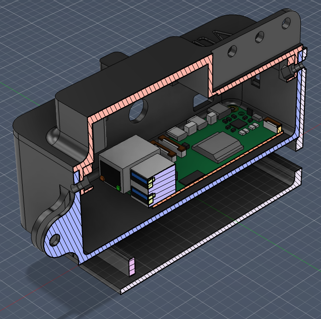
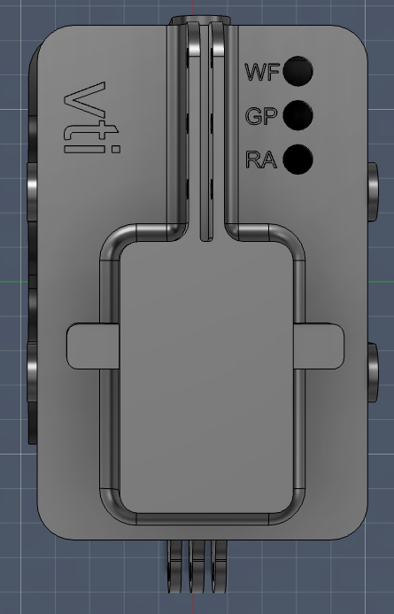
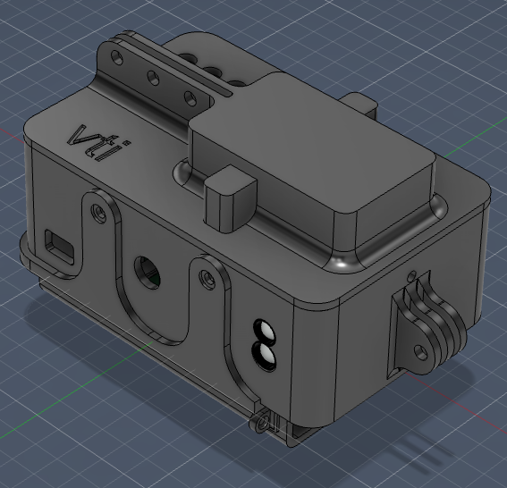

# Bicycledata Sensor Box

This repository contains the CAD models for the **Bicycledata Sensor Box**, a rugged enclosure designed for bicycle-mounted data collection.

This work was developed during a research stay at **VTI (Swedish National Road and Transport Research Institute)** in Linköping, Sweden. The visit was made possible through a travel grant from **[Humanist-VCE](https://www.humanist-vce.eu/)** in March 2026.

This enclosure is designed to house the hardware used in the **[BicycleData project](https://github.com/bicycledata)**.

---

## Project Overview

The **Bicycledata Sensor Box** is a custom-engineered housing for a Raspberry Pi-based data logger. It is designed to be mounted on bicycles to collect real-time environmental and motion data.

### Key Features
* **Status Indicators:** Integrated apertures for three status LEDs:
    * **WF**: Wi-Fi Connectivity
    * **GP**: GPS Status
    * **RA**: Connection status to wireless Radar (e.g. Garmin Varia) 
* **Standardized Mounting:** Built-in tabs compatible with standard Garmin Varia/GoPro mounts for easy attachment the seatpost using Garmin adapter.
* **Internal Component Security:** Dedicated standoffs and port clearances for a Raspberry Pi 5.

---

## Gallery

### Internal Layout (Section View)
The enclosure features a two-part shell design with internal clearances for USB and Ethernet ports.

### Top View & Interface
The top panel includes the VTI logo and clear labeling for the system status LEDs.

### Assembly Perspective
Isometric view showing the overall form factor and the integrated mounting system.

---

## Research Context

This CAD model is part of a collaborative effort to improve cycling safety and data collection infrastructure. For more information on the software and data analysis side of this project, please visit:

👉 **[BicycleData GitHub Repository](https://github.com/bicycledata)**

## License
This project is licensed under the [MIT License](LICENSE).
